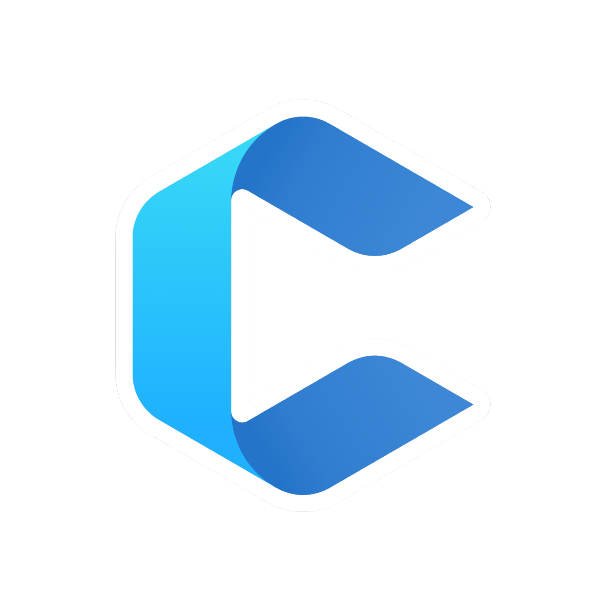

  

# PT Codevits Indonesia (Persero) Tbk ***powered by***
### JPMorgan Chase & Co. (AS), DANANTARA INDONESIA Sovereign Wealth Fund,   Amazon Inc. (AS), SoftBank Group Corp. (Japan), Huawei Technologies Co., Ltd. (China), and   Global Holding Company The Bob's of International Group (BIG Ltd.) of Singapore 🚀
***"Innovating the Future, Empowering the Nation"***

---

## 🏛️ About The Company
**PT Codevits Innovation Indonesia** atau **PT CodevitsCorp Technology and Innovation** adalah perusahaan teknologi multinasional pengembang perangkat lunak (software house elite), provider SaaS (Software as a Service), dan pengembang *Custom Enterprise Systems* berskala besar. Kami berdiri sebagai mitra strategis dalam transformasi digital bagi sektor bisnis ataupun perusahaan, agensi, organisasi maupun pemerintahan. bukan sekadar entitas bisnis di bidang teknologi. Kami adalah sebuah perwujudan mimpi yang lahir dari keresahan akan kesenjangan digital di tanah air. Lahir di jantung kebudayaan dan pendidikan Indonesia serta berkantor pusat di Pacific Building Tower Office, Yogyakarta, kota yang mempertemukan ketenangan tradisi dengan kegigihan intelektual, Codevits membawa misi tunggal: *Mengembalikan kedaulatan teknologi ke tangan bangsa*. Kami di Codevits berdedikasi pada riset inovasi teknologi masa depan guna mempercepat kemandirian digital bangsa

Kami memahami bahwa di balik setiap baris kode yang kami susun, ada harapan dari para pengusaha lokal yang ingin naik kelas, ada efisiensi pemerintahan yang dinanti masyarakat, dan ada masa depan digital Indonesia yang harus dijaga. Sebagai penyedia solusi SaaS dan Custom Enterprise Systems, kami tidak hanya membangun perangkat lunak; kami membangun fondasi bagi mereka yang berani bermimpi lebih besar.

### Mengapa Kami Berjuang?
Dunia terus berlari dalam digitalisasi, namun seringkali kita hanya menjadi penonton atau konsumen. Codevits hadir sebagai mitra strategis yang berdiri di garis depan transformasi. Kami mendedikasikan waktu kami untuk riset mendalam dan inovasi teknologi masa depan, memastikan bahwa setiap solusi yang kami lahirkan, baik itu sistem perusahaan yang kompleks maupun layanan berbasis cloud adalah manifestasi dari kemandirian bangsa.

### Apa saja Nilai yang Kami Bawa?
Perjalanan kami dalam mentransformasi lanskap digital Indonesia dipandu oleh sepuluh pilar utama yang kami sebut sebagai **Ten Values**. Inilah filosofi dasar yang mendefinisikan standar kerja, etika, dan visi kami dalam membangun masa depan teknologi yang lebih inklusif dan mandiri:

* **Empathy-Driven Innovation**: Kami mendengar sebelum mengetik. Setiap solusi dirancang untuk menyelesaikan masalah nyata, bukan sekadar mengikuti tren.
* **Future-Proofing**: Kami tidak membangun untuk hari ini saja. Kami merancang sistem yang siap menghadapi tantangan sepuluh tahun ke depan.
* **National Pride**: Dari Yogyakarta untuk dunia. Setiap karya kami adalah bukti bahwa inovasi global bisa lahir dari putra-putri terbaik bangsa.
* **Ethical Excellence**: Kami percaya teknologi tanpa integritas adalah hampa. Setiap data yang kami kelola dan sistem yang kami bangun dijaga dengan standar moral tertinggi, demi menjaga kepercayaan yang telah dititipkan oleh para mitra.
* **Bridge of Opportunity**: Kami hadir untuk menjembatani kesenjangan antara kompleksitas teknologi dan kemudahan akses. Codevits berkomitmen untuk mendemokratisasi inovasi, sehingga kemajuan digital bukan lagi kemewahan milik segelintir orang, melainkan hak bagi seluruh lapisan industri.
* **Human-Centric Development**: Kami menaruh manusia sebagai pusat dari setiap baris kode. Teknologi bagi kami hanyalah alat, sedangkan kesejahteraan dan kemudahan hidup pengguna adalah tujuan akhirnya.
* **Resilient Growth**: Kami tidak gentar pada perubahan. Seperti karang di laut selatan, Codevits dibangun untuk terus bertumbuh dan beradaptasi di tengah badai disrupsi teknologi yang tak menentu.
* **Collaborative Synergy**: Kami percaya inovasi besar tidak lahir dari isolasi. Melalui kolaborasi lintas sektor, kami menyatukan potensi-potensi tersembunyi untuk menciptakan ekosistem digital yang saling menguatkan.
* **Agile Mindset**: Kecepatan adalah kunci, namun ketepatan adalah harga mati. Kami bekerja dengan ketangkasan tinggi untuk menghadirkan solusi yang relevan secara instan tanpa mengorbankan kualitas detail.
* **Legacy of Impact**: Kami bekerja bukan hanya untuk hari ini atau esok. Setiap proyek yang kami sentuh adalah upaya untuk meninggalkan warisan digital yang bermanfaat bagi generasi mendatang, memastikan Indonesia tetap tegak di panggung dunia.

***Di Codevits, kami percaya bahwa teknologi adalah bahasa masa depan. Dan kami di sini untuk memastikan Indonesia tidak hanya mengerti bahasa tersebut, tapi juga fasih memimpin percakapannya.***

## 🎖️ The Founding Journey
Perjalanan kami dimulai dari visi sekelompok inovator dari **Universitas Respati Yogyakarta**. Codevits berhasil meraih pendanaan (founding) prestisius melalui seleksi nasional **Program Pembinaan Mahasiswa Wirausaha (P2MW)** di bawah naungan **Direktorat Belmawa, Kementerian Pendidikan Tinggi, Sains dan Teknologi Republik Indonesia**. 

Kepercayaan terhadap inovasi kami semakin diperkuat dengan keberhasilan meraih dukungan pendanaan melalui **Program Riset Badan Riset dan Inovasi Nasional (BRIN)**. Sinergi antara dukungan pemerintah dan dedikasi riset ini menjadi batu loncatan utama bagi kami untuk melegalkan entitas perusahaan serta memperluas jangkauan inovasi dari skala nasional menuju panggung internasional.

## 👥 Board of Directors (C-Suite)
Struktur kepemimpinan kami terdiri dari para ahli yang menggabungkan kapabilitas teknis dengan visi bisnis yang tajam:

| Position | Name | Responsibility |
| :--- | :--- | :--- |
| Board of Commisioners |
| **President of the Board of Commissioners** | **Dr. Satya Widya Yudha, M.Sc., Ph.D.   -- Anggota Dewan Energi Nasional Republik Indonesia (DEN-RI) periode 2026-2030** | Pengawasan Strategis & Tata Kelola Perusahaan |
| Board of Directors (C-Suite Level) |
| **Founder, President Director, Chairman & Chief Executive Officer (CEO)** | **Dimas Oktavian Prasetyo, S.Kom** | Direktur Utama/Pemimpin Utama & Strategis Visi Perusahaan |
| **Co-Founder & Chief of Technology Officer (CTO)** | **Sohail Salehi, B.Sc.** | Direktur Riset, Teknologi, & Pengembangan Inovasi |
| **Chief of Operations Officer (COO)** | **...** | Direktur Operasional, Kemitraan, & Kerjasama Strategis |
| **Chief of Finance Officer (CFO)** | **...** | Direktur Keuangan & Manajemen Aset Perusahaan |
| **Chief Product & Marketing Officer	(CPMO)** | **...** | Pengembang Produk & Strategi Penetrasi Pasar |
| **Chief Human Capital Officer	(CHCO)** | **...** |	Transformasi Budaya & Pengembangan Talenta Perusahaan |
| **Chief Information Security Officer (CISO)** |	**...** | Penanggung Jawab Keamanan Data & Privasi Informasi |

## 🎯 Vision & Mission (Dasa Cita Codevits)

### **Visi**
Menjadi pusat inovasi teknologi digital terdepan di Asia Tenggara yang menginspirasi transformasi global demi masa depan bangsa yang mandiri dan berdaya saing tinggi.

### **Misi (Dasa Cita Codevits)**
1. **Digital Sovereignty:** Mewujudkan kedaulatan digital melalui produk software karya anak bangsa.
2. **Enterprise Excellence:** Menyediakan solusi enterprise kelas dunia yang adaptif dan skalabel.
3. **Synergy & Collaboration:** Menjadi mitra transformasi digital paling terpercaya bagi pemerintah dan swasta.
4. **Future Research:** Terus melakukan riset mendalam pada AI, Cloud, dan Future Tech Inovation.
5. **Innovation for All:** Menghadirkan software SaaS yang inklusif untuk UMKM hingga korporasi besar.
6. **Economic Impact:** Mempercepat pertumbuhan ekonomi melalui efisiensi sistem digital.
7. **Talent Empowerment:** Membina talenta lokal menjadi tenaga ahli berstandar internasional.
8. **Government Digitalization:** Mendukung implementasi SPBE (Sistem Pemerintahan Berbasis Elektronik).
9. **Global Reach:** Membawa nama Indonesia ke panggung teknologi global melalui ekspor solusi digital.
10. **Sustainable Legacy:** Membangun ekosistem teknologi yang berkelanjutan untuk memastikan warisan inovasi yang bermanfaat bagi generasi mendatang.

## 🛠️ Core Business Pillars
*   **SaaS Ecosystem:** Pengembangan aplikasi berbasis langganan (EQUITY ERP Business Suite Platforms, EQUIPE, dsb) untuk efisiensi bisnis.
*   **Custom Enterprise Solution:** Pengembangan sistem spesifik berskala besar untuk kebutuhan unik korporasi.
*   **Digital Transformation Agency:** Konsultan dan pelaksana transformasi digital end-to-end.
*   **Future Tech Research:** Unit khusus untuk riset AI melalui **Aletra Technology Innovation**, Web3 atau Blockchain, Robotics dan Internet of Things (IoT).

## 🤝 Partners & Clients
Kami terbuka untuk kolaborasi strategis dalam membangun ekosistem digital yang lebih kuat.
*   **Governmental Agencies**
*   **Small & Medium Enterprises (SMEs)**
*   **International Agencies & Partners**
*   **Enterprise & Multinational Corporations (Korporasi Besar & Perusahaan Multinasional)**
*   **Academic & Research Institutions (Akademisi & Lembaga Riset)**
*   **Financial & Banking Sectors (Sektor Keuangan & Perbankan)**
*   **Non-Profit & Social Organizations (Organisasi Non-Profit & Sosial)**

***Mari berdiskusi tentang bagaimana kami dapat membantu mengakselerasi visi digital Anda. Kami percaya bahwa melalui kolaborasi yang tepat, tidak ada batasan yang tidak bisa kita tembus***

## 📬 Let's Connect & Collaborate
Kami percaya setiap inovasi besar dimulai dari sebuah percakapan sederhana. Mari bangun masa depan bersama.

<table width="100%">
  <thead>
    <tr border="0">
      <th align="center" width="33%" style="border: none;">
        <h3>📍 Head Office</h3>
        
Yogyakarta, Indonesia <i>The Heart of Innovation</i>

      </th>
      <th align="center" width="33%" style="border: none;">
        <h3>📧 Email Inquiry</h3>
        

          <a href="mailto:info@codevits.com">info@codevits.com</a> 
          <a href="mailto:business@codevits.com">business@codevits.com</a>
        

      </th>
      <th align="center" width="33%" style="border: none;">
        <h3>🌐 Digital Presence</h3>
        

          <a href="https://codevits.id">www.codevits.com</a> 
          <i>Explore Our Solutions</i>
        

      </th>
    </tr>
  </thead>
</table>

   
  
  &nbsp;
  
  &nbsp;
  

---

  Copyright © 2026 PT Codevits Innovation Indonesia.  
  Built with ❤️ for the Future of Indonesia.

